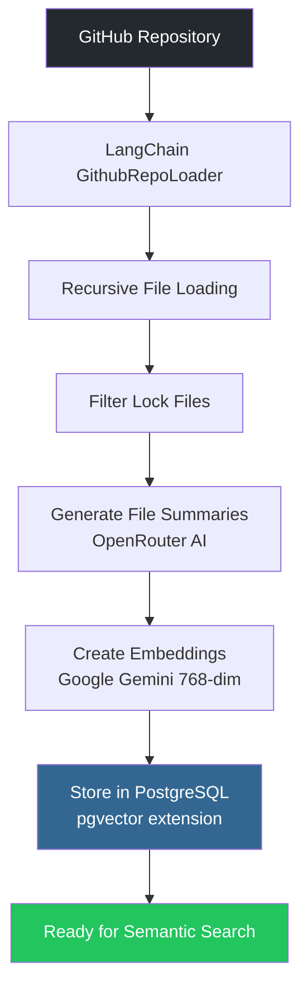
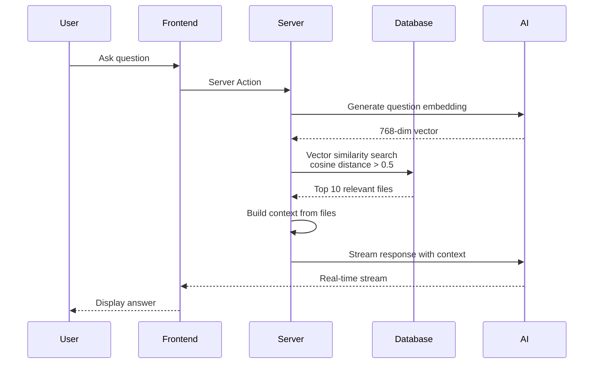
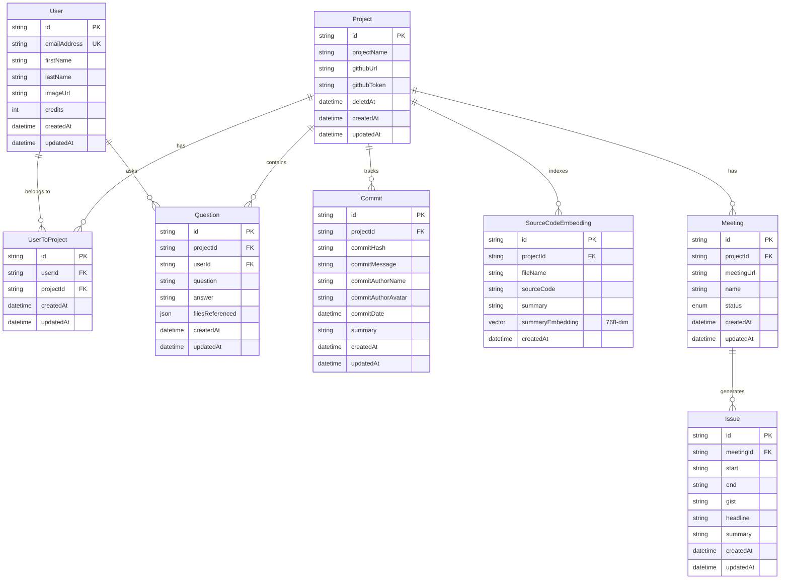

# Mach - AI Codebase Intelligence

Although I have never had an internship, I have always wondered how new interns deal with thousands of lines of code written for decades. I cannot even remember how I coded my own project before I took a break for finals T_T.

**Mach** is my attempt to solve that problem. It's an AI-powered platform that helps developers understand complex codebases through natural language queries. Whether you're onboarding to a new company, maintaining legacy code, or just trying to remember what you built last month, Mach makes codebases accessible through intelligent semantic search.

## The Problem

Codebases grow. They accumulate years of decisions, refactors, and "quick fixes" that become permanent. When you join a new team or return to an old project, you're essentially an archaeologist trying to understand ancient history—except the documentation is sparse and the original authors are long gone (or have forgotten what they built).

Traditional methods don't scale:
- **Grep is too literal**: It finds text, not meaning
- **Documentation is outdated**: By the time docs are written, code has changed
- **Asking teammates is hit-or-miss**: They might not remember, or might be busy
- **Reading everything is impractical**: Large codebases have thousands of files

Mach changes that by using AI to understand your code semantically, letting you ask questions in plain English and getting answers with context.

## Features

### 🎯 Semantic Code Search

Ask questions about your codebase in natural language. Mach uses vector embeddings to understand the *meaning* behind code, not just keywords.

```
You: "How does authentication work in this project?"
Mach: [Provides explanation with references to relevant files]
```

The system:
- Generates 768-dimensional embeddings for every code file using Google Gemini
- Stores embeddings in PostgreSQL with pgvector extension
- Uses cosine similarity to find the most relevant code files
- Retrieves top 10 matches with similarity threshold > 0.5
- Builds context from file summaries, source code, and AI-generated insights

### 📚 Automated Repository Indexing

Link any GitHub repository and Mach automatically:
- Recursively loads all source files using LangChain
- Generates AI-powered summaries for each file (max 100 words)
- Creates vector embeddings for semantic search
- Stores everything in a structured, queryable format

The indexing pipeline processes entire repositories intelligently, skipping lock files and common build artifacts. It handles large codebases by processing files in parallel with configurable concurrency.

### 💬 AI-Powered Q&A

Mach doesn't just find code—it explains it. The Q&A system:
- Streams responses in real-time for better UX
- References specific files and code snippets
- Provides step-by-step explanations when needed
- Saves conversations for future reference

Each answer is contextually aware, built from the most relevant code files in your repository. The AI model (via OpenRouter) understands technical concepts and can explain code like a senior engineer onboarding a junior developer.

### 📝 Intelligent Commit Tracking

Never miss what changed. Mach automatically:
- Fetches commit history from GitHub
- Analyzes diffs to understand changes
- Generates concise summaries of what each commit does
- Tracks commit authors and timelines

Instead of reading through cryptic commit messages or massive diffs, you get clear, AI-generated summaries that tell you exactly what changed and why it matters.

### 🎤 Meeting Analysis

Upload meeting recordings and Mach extracts actionable insights:
- Transcribes audio using AssemblyAI
- Automatically identifies discussion topics (auto-chapters)
- Creates structured summaries with time codes
- Categorizes discussions into trackable issues

Perfect for standups, retrospectives, or any meeting where you need to remember what was discussed and who said what.

### 👥 Team Collaboration

Mach isn't just for solo developers:
- Share projects with team members via invite links
- Collaborate on understanding codebases together
- Track questions and answers across the team
- Archive projects when done (soft delete)

## How It Works

### Codebase Indexing Pipeline



1. **Repository Loading**: LangChain's `GithubRepoLoader` recursively traverses the repository structure
2. **File Processing**: Each source file is processed in parallel (max 5 concurrent operations)
3. **Summarization**: AI generates concise summaries explaining each file's purpose
4. **Embedding Generation**: Google Gemini creates 768-dimensional vector embeddings from summaries
5. **Storage**: Embeddings stored in PostgreSQL with pgvector for efficient similarity search

### Q&A Flow



The Q&A system uses vector similarity to find relevant code, then builds a rich context for the AI to generate accurate, detailed answers.

### Commit Tracking Pipeline


Commits are processed asynchronously. The system tracks which commits have been processed to avoid redundant API calls and AI processing.

## Database Design



### Key Design Decisions

- **Vector Embeddings**: Stored directly in PostgreSQL using pgvector extension for efficient similarity search
- **Soft Deletes**: Projects use `deletedAt` timestamp instead of hard deletion (allows recovery)
- **Many-to-Many Relationships**: `UserToProject` junction table enables team collaboration
- **JSON Storage**: `filesReferenced` in Question model stores flexible metadata about code references
- **Timestamps**: All models track `createdAt` and `updatedAt` for audit trails

## Tech Stack

**Frontend**
- Next.js 15 with App Router (Server Components by default)
- React 19
- TypeScript (strict mode)
- Tailwind CSS + shadcn/ui
- tRPC for type-safe APIs

**Backend**
- tRPC 11 for end-to-end type safety
- Prisma ORM with PostgreSQL
- pgvector extension for vector search
- Clerk for authentication

**AI & ML**
- OpenRouter SDK for LLM access
- Google Gemini for embeddings (768 dimensions)
- AssemblyAI for meeting transcription

**External Services**
- GitHub API (via Octokit) for repository access
- LangChain for document processing
- Firebase Storage for meeting audio files

**Infrastructure**
- PostgreSQL with pgvector extension
- Server-side rendering and streaming
- Parallel processing with Promise.allSettled
- Background job processing

## Architecture Highlights

### Type Safety from Database to Frontend

The entire stack is type-safe. Changes to the database schema automatically propagate through Prisma → tRPC → React components. No manual API route definitions needed—tRPC generates everything.

### Server-First Architecture

Next.js 15's App Router enables a server-first approach. Most components are Server Components by default, reducing client-side JavaScript and improving performance. Client Components are used sparingly, only when interactivity is required.

### Intelligent Caching

React Query handles server state caching, with tRPC procedures cached automatically. The system refetches intelligently based on mutation invalidation, ensuring data consistency without unnecessary network requests.

### Error Resilience

Critical operations use `Promise.allSettled` instead of `Promise.all`, ensuring that one failure doesn't break the entire batch. This is especially important during repository indexing, where processing hundreds of files might encounter occasional failures.

## Project Structure

```
mach/
├── src/
│   ├── app/                    # Next.js App Router pages
│   │   ├── (protected)/        # Protected routes (dashboard, Q&A, meetings)
│   │   ├── api/                # API routes (tRPC, meeting processing)
│   │   └── sync-user/          # User synchronization
│   ├── components/             # Reusable UI components (shadcn/ui)
│   ├── hooks/                  # Custom React hooks
│   ├── lib/                    # Core libraries (AI, GitHub, Firebase)
│   ├── server/                 # Server-side code
│   │   ├── api/                # tRPC routers
│   │   └── db.ts               # Prisma client
│   ├── styles/                 # Global styles
│   └── trpc/                   # tRPC client setup
├── prisma/
│   └── schema.prisma           # Database schema
└── generated/
    └── prisma/                 # Generated Prisma client
```

## Current Limitations & Future Work

**What's Working**
- Repository indexing for public GitHub repos
- Semantic code search with vector embeddings
- AI-powered Q&A with streaming responses
- Commit tracking with AI summaries
- Meeting transcription and analysis

**Known Issues**
- Database field typo: `deletdAt` should be `deletedAt` (to be fixed)
- No pagination for commits/questions (could be slow for large datasets)
- Polling every 4 seconds for meeting status (should use WebSockets)
- GitHub tokens stored in plaintext (should be encrypted)

**Planned Improvements**
- Incremental repository indexing (only process changed files)
- WebSocket support for real-time updates
- Rate limiting on API endpoints
- Encryption for sensitive data (GitHub tokens)
- Batch processing for large repositories
- Search filters and pagination
- Code change detection and notifications

## Why I Built This

I built Mach because I believe understanding code shouldn't be a struggle. Whether you're:
- A new intern trying to understand a legacy codebase
- A developer returning to a project after months away
- A team lead onboarding new members
- Someone maintaining code written years ago

Mach should make that easier. It's not perfect, but it's a start. And honestly, if it helps even one person avoid the "what did I build here?" moment, that's a win.

---

Built with ❤️ and a lot of coffee. If you find this useful or have suggestions, feel free to reach out!
